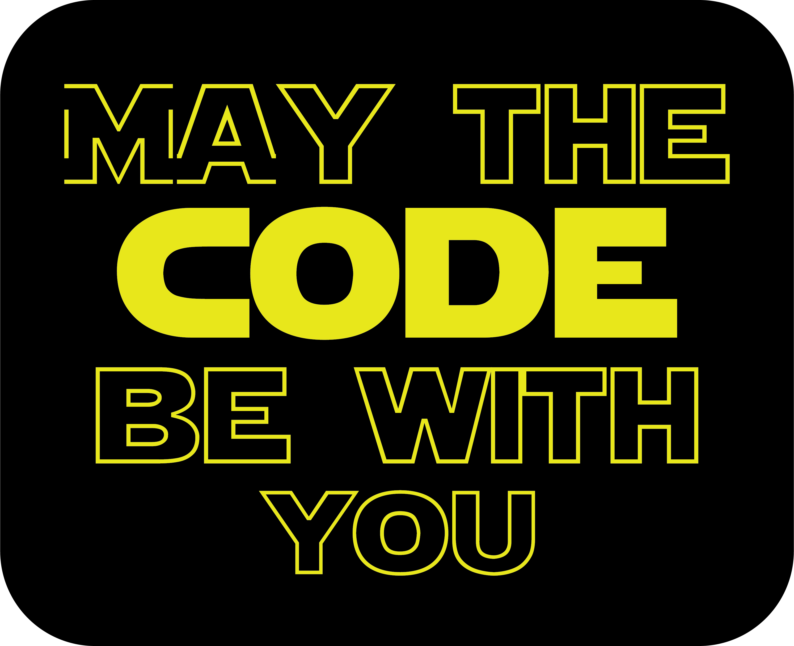

<h1 align="center">Desenho Amoung Us em HTML e CSS</h1>

  
  

<blockquote align="center">“A chave para transformação é a continuidade. Continue a codar!”</blockquote>

 

 
 

## Apresentação 
 

  

 

## Sobre o desenho do Amoung Us em HTML e CSS
 

    Encontrei no youtube um vídeo de como desenhar um personagem do Amoung Us em HTML e CSS. Gostei muito e resolvi fazer o meu acompanhando o vídeo.
    Faça o seu também!
    Divirtam-se!

https://www.youtube.com/watch?v=JDI0zz2Waqw

 

## Tecnologias Utilizadas
 

- [x] HTML
- [x] CSS

 
 

 
 

<h3 align="center">
    
</h3>